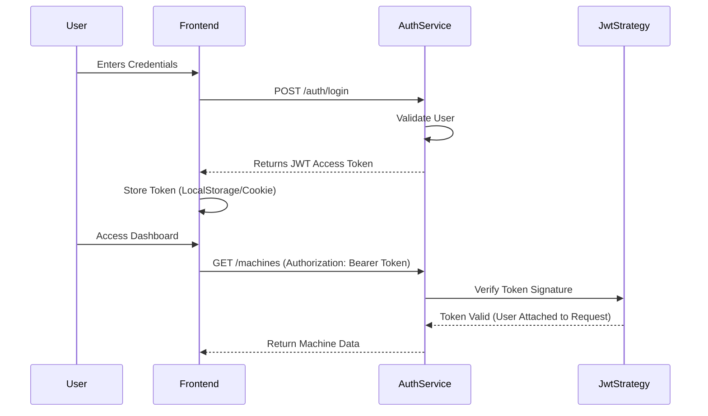
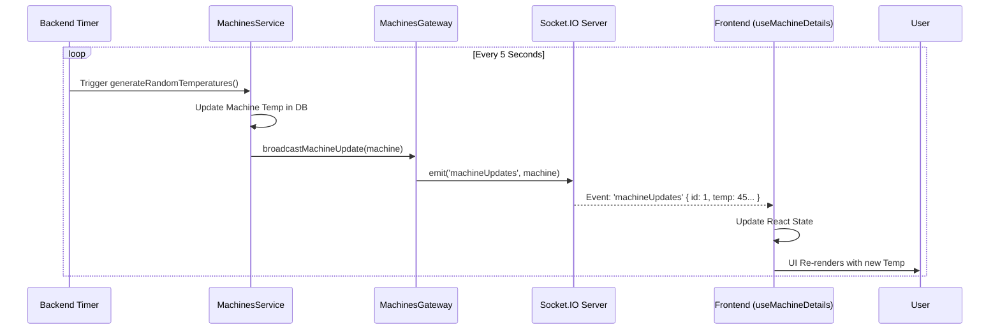

# System Architecture Documentation

This document provides a comprehensive overview of the Machine Monitoring Application's architecture, covering the frontend, backend, database, and real-time communication layers.

## 1. High-Level Architecture

The application follows a standard **Client-Server** architecture with a **Microservices-ready** modular backend.

```mermaid
graph TD
    Client[Frontend (Next.js)] <-->|HTTP/REST| API[Backend API (NestJS)]
    Client <-->|WebSocket (Socket.IO)| Gateway[WebSocket Gateway]
    API <-->|Mongoose| DB[(MongoDB)]
    Gateway <-->|Internal Events| Service[Machines Service]
    
    subgraph Backend
    API
    Gateway
    Service
    end
```

---

## 2. Backend Architecture (NestJS)

The backend is built with **NestJS**, a progressive Node.js framework. It is organized into **Modules**.

### Core Modules

1.  **AppModule**: The root module that orchestrates everything.
2.  **AuthModule**: Handles user authentication.
    *   **Passport.js**: Used for authentication strategies.
    *   **JWT Strategy**: Validates JSON Web Tokens for protected routes.
    *   **AuthService**: Validates users and generates tokens.
3.  **MachinesModule**: Manages machine data.
    *   **MachinesController**: Handles HTTP requests (GET, POST).
    *   **MachinesService**: Contains business logic (CRUD operations, random temperature generation).
    *   **MachinesGateway**: Handles WebSocket connections for real-time updates.

### Database Schema (MongoDB)

We use **Mongoose** to model data.

**Machine Schema (`machine.schema.ts`)**
```typescript
export class Machine {
    id: number;          // Unique identifier
    name: string;        // Machine name (e.g., "Machine A")
    status: string;      // "Running" | "Stopped" | "Idle"
    temperature: number; // Current temperature
    energyConsumption: number; // Energy usage metric
}
```

---

## 3. Frontend Architecture (Next.js)

The frontend is built with **Next.js 14** (App Router) and **TypeScript**.

### Component Structure

*   **`page.tsx`**: The main dashboard page. It manages the list of machines and handles the "Edit" vs "View" mode switching.
*   **`components/MachineViewMode.tsx`**: Displays machine details (read-only).
*   **`components/MachineEditMode.tsx`**: A form to update machine details (name, status).

### Custom Hooks (State & Logic)

1.  **`useSocket.ts`**:
    *   Initializes the Socket.IO client connection.
    *   Listens for `machineUpdates` events from the server.
    *   Returns the `socket` instance for other components to use.

2.  **`useMachineDetails.ts`**:
    *   Fetches the initial list of machines from the REST API (`GET /machines`).
    *   Subscribes to real-time updates using `useSocket`.
    *   When a `machineUpdates` event arrives, it automatically updates the local state, ensuring the UI reflects the new temperature instantly without reloading.

3.  **`useIdleTimeout.ts`**:
    *   Monitors user activity (mouse movement, key presses).
    *   If the user is inactive for a set period (e.g., 15 minutes), it triggers a logout or warning.

---

## 4. Data Flow Scenarios

### A. Authentication Flow

How a user logs in and accesses protected data.



### B. Real-Time Update Flow (WebSockets)

How the dashboard updates temperatures live without refreshing.



## 5. Key Technologies

*   **NestJS**: Backend framework for scalable server-side applications.
*   **Next.js**: React framework for the frontend.
*   **MongoDB**: NoSQL database for flexible data storage.
*   **Socket.IO**: Library for real-time, bidirectional communication.
*   **Passport-JWT**: Middleware for securing REST endpoints with tokens.
*   **Tailwind CSS**: Utility-first CSS framework for styling.
